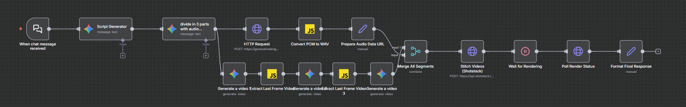

# 🎬 AI-Powered Text-to-Video Generation Pipeline

> **Turn simple text prompts into fully produced, narrated videos in seconds.**

[]()
[]()
[]()
[]()

## 🚀 Our Vision
We are building an autonomous content creation engine. Our goal is to streamline the video production process by creating a seamless bridge between a user's idea and a broadcast-ready video. By leveraging **n8n as a no-code backend**, we orchestrate multiple AI agents to script, visualize, narrate, and edit videos automatically.

**[View the Live Frontend](https://sassycodes.github.io)**

---

## ⚙️ How It Works (The Architecture)

Our system is powered by a complex **n8n workflow** that handles parallel processing for audio and video, ensuring efficiency and visual consistency.



### The Workflow Steps:

1.  **Input & Script Generation (The Director)**
    * The user provides a simple one-liner idea.
    * **Gemini API** (acting as a "World-Class Direct Response Director") expands this into a full script using the **PAS (Problem, Agitation, Solution)** or **AIDA** frameworks.
    * The script is formatted into a JSON object containing `voiceover_text` and three distinct visual prompts (`prompt_part_1`, `2`, & `3`).

2.  **Parallel Asset Generation**
    The workflow splits into two simultaneous branches:

    * **🔊 Audio Branch:**
        * The script text is sent to **Gemini TTS (Text-to-Speech)**.
        * PCM audio is converted to WAV format and prepared as a data URL.

    * **🎥 Video Branch (Visual Continuity Engine):**
        * We utilize **Google Veo** models to generate video segments.
        * *Innovative Logic:* To prevent the "flickering" style common in AI video, we use custom **JavaScript nodes**.
        * The system extracts the **last frame** of *Video Part 1* and feeds it as the input for *Video Part 2*. This ensures the character, setting, and lighting remain consistent across the entire timeline.

3.  **Post-Production (The Editor)**
    * **Shotstack API** receives the three video segments and the audio file.
    * It stitches the visuals together, overlays the audio track, and renders the final output.

4.  **Delivery**
    * The system polls for the render status and delivers the final video URL back to the frontend.

---

## 🛠️ Tech Stack

* **Frontend:** HTML5, CSS3, JavaScript (Hosted on GitHub Pages).
* **Backend Orchestration:** [n8n](https://n8n.io/) (Workflow Automation).
* **LLM & Scripting:** Google Gemini API.
* **Video Generation:** Google Veo / Imagen Models.
* **Audio Generation:** Gemini TTS.
* **Video Editing/Stitching:** Shotstack API.

---
## 🧠 Prompt Engineering

The quality of our output relies on rigorous prompt engineering. Below are the core system prompts driving the agent:

<details>
<summary><strong>Click to view Script Generation Prompt</strong></summary>

```text
Act as a world-class Direct Response Video Director. I need a video ad script for the following:

Product/Service: [Insert Name Here]
Target Audience: [Insert Audience]
Problem Solved: [Insert Problem]
Key Benefit: [Insert Benefit]
Tone: [Insert Tone]
Platform: [Insert Platform]
Duration: [e.g., 30 seconds]

Instructions:
1. Use the PAS Framework (Problem, Agitation, Solution) or AIDA.
2. The first 3 seconds must contain a "Visual Hook" to stop the scroll.
3. Format the output as a Markdown Table with columns: Time, Visual Scene, Audio/Dialogue.
4. Include a specific Call to Action (CTA).
```
</details>
---
<details> <summary><strong>Click to view JSON Structure Prompt</strong></summary>

```text

You are an expert video script generator. Based on the user's video topic, generate a JSON object with exactly 4 fields:

1. 'voiceover_text' (approximately 60 words for a 30-second video)
2. 'prompt_part_1' (detailed visual prompt for the first 10 seconds)
3. 'prompt_part_2' (detailed visual prompt for the second 10 seconds, continuing from part 1 with the same character/setting)
4. 'prompt_part_3' (detailed visual prompt for the final 10 seconds, continuing from part 2 with the same character/setting).

Ensure visual continuity across all three parts - the same character, setting, and visual style must be maintained throughout.

```
---
</details>

## 🧩 Key Features

* **Framework-Driven Scripting:** Scripts are not random; they follow marketing psychology principles (PAS/AIDA) to ensure high engagement.
* **Visual Consistency:** Unlike standard generators, our "Last-Frame Injection" technique ensures characters don't morph randomly between scenes.
* **Automated Voiceover:** Synced high-quality audio generation.
* **No-Code Backend:** Built entirely on n8n for rapid iteration and scalability.

---

## 🚧 Roadmap

- [x] Frontend UI (Landing Page)
- [x] n8n Workflow Logic (Script -> Audio/Video -> Merge)
- [x] Integration of Shotstack for stitching
- [ ] **Current Focus:** Connecting the Frontend `fetch` request to the n8n Webhook.
- [ ] User authentication.
- [ ] Gallery of generated videos.

---

## 🤝 Contributing

This project is currently being developed for **Neuro_sys**. If you have ideas on how to improve the prompt engineering or the n8n flow, feel free to open an issue!

---

*Built with ❤️ by Team Genesis*
